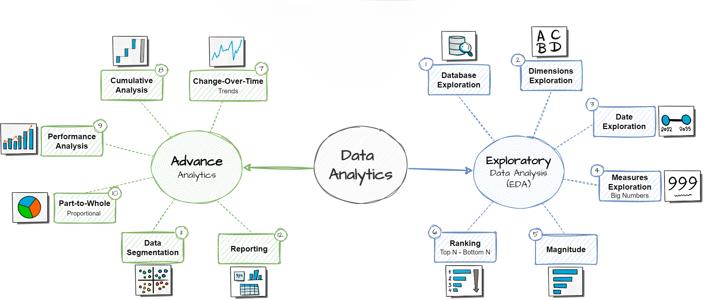

# Data Warehouse and Analytics Project

Welcome to the **Data Warehouse and Analytics Project** repository! 🚀  
This project demonstrates a comprehensive data warehousing and analytics solution, from building a data warehouse to generating actionable insights. Designed as a portfolio project, it highlights industry best practices in data engineering and analytics.

---
## 🏗️ Data Architecture

The data architecture for this project follows Medallion Architecture **Bronze**, **Silver**, and **Gold** layers:


1. **Bronze Layer**: Stores raw data as-is from the source systems. Data is ingested from CSV Files into SQL Server Database.
2. **Silver Layer**: This layer includes data cleansing, standardization, and normalization processes to prepare data for analysis.
3. **Gold Layer**: Houses business-ready data modeled into a star schema required for reporting and analytics.

---
## 📖 Project Overview

This project involves:

1. **Data Architecture**: Designing a Modern Data Warehouse Using Medallion Architecture **Bronze**, **Silver**, and **Gold** layers.
2. **ETL Pipelines**: Extracting, transforming, and loading data from source systems into the warehouse.
3. **Data Modeling**: Developing fact and dimension tables optimized for analytical queries.
4. **Analytics & Reporting**: Creating SQL-based reports and dashboards for actionable insights.

🎯 This repository is an excellent resource for professionals and students looking to showcase expertise in:
- SQL Development
- Data Architect
- Data Engineering  
- ETL Pipeline Developer  
- Data Modeling  
- Data Analytics  

---

## 🛠️ Important Tools:

Everything is for Free!
- **[Datasets](datasets/):** Access to the project dataset (csv files).
- **[SQL Server Express](https://www.microsoft.com/en-us/sql-server/sql-server-downloads):** Lightweight server for hosting your SQL database.
- **[SQL Server Management Studio (SSMS)](https://learn.microsoft.com/en-us/sql/ssms/download-sql-server-management-studio-ssms?view=sql-server-ver16):** GUI for managing and interacting with databases.
- **[Git Repository](https://github.com/):** Set up a GitHub account and repository to manage, version, and collaborate on your code efficiently.
- **[DrawIO](https://www.drawio.com/):** Design data architecture, models, flows, and diagrams.
- **[Notion](https://www.notion.com/):** All-in-one tool for project management and organization.
- **[Notion Project Steps](https://www.notion.so/SQL-Data-Warehouse-Project-295bda41331f801fa886d700d4666910?source=copy_link):** Access to All Project Phases and Tasks.

---

## 🚀 Project Requirements

### Building the Data Warehouse (Data Engineering)

#### Objective
Develop a modern data warehouse using SQL Server to consolidate sales data, enabling analytical reporting and informed decision-making.

#### Specifications
- **Data Sources**: Import data from two source systems (ERP and CRM) provided as CSV files.
- **Data Quality**: Cleanse and resolve data quality issues before analysis.
- **Integration**: Combine both sources into a single, user-friendly data model designed for analytical queries.
- **Scope**: Focus on the latest dataset only; historization of data is not required.
- **Documentation**: Provide clear documentation of the data model to support both business stakeholders and analytics teams.

---

### BI: Analytics & Reporting (Data Analysis)

#### Objective
Develop SQL-based analytics to deliver detailed insights into:
- **Customer Behavior**
- **Product Performance**
- **Sales Trends**

These insights empower stakeholders with key business metrics, enabling strategic decision-making.  

#### Analytics Roadmap


The analytics phase follows a structured roadmap split into two tracks:

- **Exploratory Data Analysis (EDA)** — Database exploration, dimensions, date ranges, measures, magnitude, and ranking analysis.
- **Advanced Analytics** — Change-over-time trends, cumulative analysis, performance analysis, part-to-whole proportions, data segmentation, and final reporting.

Each step is implemented as a standalone SQL script in the [`scripts/analytics/`](scripts/analytics/) folder.


## 📂 Repository Structure
```
data-warehouse-project/
│
├── datasets/                           # Raw datasets used for the project (ERP and CRM data)
│   ├── source_crm/                     # CRM source system data
│   │   ├── cust_info.csv               # Customer information
│   │   ├── prd_info.csv                # Product information
│   │   └── sales_details.csv           # Sales transaction details
│   └── source_erp/                     # ERP source system data
│       ├── CUST_AZ12.csv               # Customer data
│       ├── LOC_A101.csv                # Location data
│       └── PX_CAT_G1V2.csv            # Product category data
│
├── docs/                               # Project documentation and architecture details
│   ├── analytics_roadmap.png           # Visual roadmap of the analytics phase
│   ├── data_architecture.png           # Project architecture diagram
│   ├── data_catalog.md                 # Catalog of datasets, including field descriptions and metadata
│   ├── data_flow.drawio.png            # Data flow diagram
│   ├── data_integration.drawio.png     # Data integration model diagram
│   ├── data_model.drawio.png           # Data models diagram (star schema)
│   └── naming_conventions.md           # Consistent naming guidelines for tables, columns, and files
│
├── scripts/                            # SQL scripts for ETL and transformations
│   ├── init_database.sql               # Database initialization script
│   ├── bronze/                         # Scripts for extracting and loading raw data
│   │   ├── ddl_bronze.sql              # Bronze layer table definitions
│   │   └── proc_load_bronze.sql        # Stored procedure to load raw data
│   ├── silver/                         # Scripts for cleaning and transforming data
│   │   ├── ddl_silver.sql              # Silver layer table definitions
│   │   └── proc_load_silver.sql        # Stored procedure for data cleansing & transformation
│   ├── gold/                           # Scripts for creating analytical models
│   │   └── ddl_gold.sql                # Gold layer views / table definitions (star schema)
│   └── analytics/                      # SQL-based analytics and reporting scripts
│       ├── 01_dimensions_exploration.sql
│       ├── 02_date_range_exploration.sql
│       ├── 03_measures_exploration.sql
│       ├── 04_magnitude_analysis.sql
│       ├── 05_ranking_analysis.sql
│       ├── 06_change_over_time_analysis.sql
│       ├── 07_cumulative_analysis.sql
│       ├── 08_performance_analysis.sql
│       ├── 09_part_to_whole_analysis.sql
│       ├── 10_data_segmentation.sql
│       ├── 11_report_customers.sql
│       └── 12_report_products.sql
│
├── tests/                              # Test scripts and quality checks
│   ├── quality_checks_gold.sql                         # Gold layer quality checks
│   ├── silver_crm_customer_table_quality_check.sql     # Silver CRM customer quality check
│   ├── silver_crm_product_table_quality_check.sql      # Silver CRM product quality check
│   ├── silver_crm_sales_table_quality_check.sql        # Silver CRM sales quality check
│   ├── silver_erp_category_table_quality_check.sql     # Silver ERP category quality check
│   ├── silver_erp_customer_table_quality_check.sql     # Silver ERP customer quality check
│   └── silver_erp_location_table_quality_check.sql     # Silver ERP location quality check
│
├── README.md                           # Project overview and instructions
└── LICENSE                             # License information for the repository
```
---


## 🙏 Acknowledgments

This project was built following the guidance of **[Baraa Khatib Salkini](https://www.datawithbaraa.com/)**, whose structured teaching approach and hands-on methodology made complex data warehousing concepts accessible and practical. A huge thank you for the outstanding mentorship!

> **Disclaimer:** This repository represents my own implementation of the project for learning and portfolio purposes. All code and documentation were written by me as part of the course. If you're interested in the full curriculum, I highly recommend visiting [datawithbaraa.com](https://www.datawithbaraa.com/).

---

## 🛡️ License

This project is licensed under the [MIT License](LICENSE). You can use, modify, and share this project with proper attribution.
